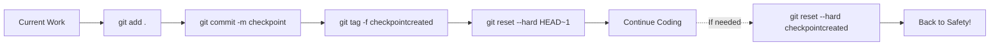

# VibeCodingCheckpoint 🎯

A revolutionary Git-based checkpoint system that lets you code with confidence, experiment freely, and always have a safe point to return to when things get messy.

## 🚀 What is VibeCodingCheckpoint?

VibeCodingCheckpoint is a smart Git wrapper that creates a "floating head" checkpoint system. It's designed for developers who want to:
- **Experiment fearlessly** with new ideas
- **Maintain flow state** without worrying about breaking things
- **Quickly recover** from coding mishaps
- **Focus on creativity** rather than version control complexity

## 🧠 The Magic: Git Floating Tag Technique

### How It Works:

VibeCodingCheckpoint uses a clever Git technique called "floating tags":

1. **Stage Everything**: `git add .` - Capture all current changes
2. **Temporary Commit**: `git commit -m "checkpointcreated-TIMESTAMP"` - Create a snapshot
3. **Tag the Snapshot**: `git tag -f checkpointcreated` - Mark this specific commit
4. **Reset Gracefully**: `git reset --hard HEAD~1` - Return to previous state
5. **Voilà!**: You now have an invisible safety net

### The Floating Tag Concept:

```
Timeline: [A] -- [B] -- [C] -- [D] (current work)
                        ↑
                 checkpointcreated (tag)
```

The tag "floats" at commit [C], while you continue working from [D]. If you mess up, simply reset to the tag!

## ⚡ Quick Start

### For Windows (PowerShell):
```powershell
# Load the magic
. .\VibeCodingCheckpoint.ps1

# Create your safety net
makecheckpoint

# Code fearlessly... then if needed:
resetcheckpoint
```

### For Linux/Mac (Bash):
```bash
# Load the magic
source vibecheckpoint.sh

# Create your safety net
makecheckpoint

# Code fearlessly... then if needed:
resetcheckpoint
```

## 🎮 Available Commands

| Command | Description | Vibe |
|---------|-------------|------|
| `makecheckpoint` | Create a safety net checkpoint | 🛡️ Set your safety net |
| `resetcheckpoint` | Return to last checkpoint | 🔄 Undo the mess |
| `checkcheckpoint` | Check if checkpoint exists | 👀 Verify safety net |
| `deletecheckpoint` | Remove current checkpoint | 🗑️ Clean up old nets |

## 🎯 Perfect for Vibe Coding

### Why Vibe Coders Love This:

1. **Zero Interruption**: No breaking your flow with manual Git commands
2. **Instant Recovery**: One command to undo hours of messy experimentation
3. **Clean History**: No pollution of your Git history with temporary commits
4. **Mental Freedom**: Code with the confidence that you can always go back

### Real-World Vibe Coding Scenario:

```bash
# Start vibing on a new feature
. .\VibeCodingCheckpoint.ps1
makecheckpoint

# Go wild with experiments 🔥
# Try radical refactoring
# Test crazy algorithms  
# Break everything multiple times

# Oops, went too far? No problem!
resetcheckpoint

# Right back to your clean starting point! 🎉
# Continue vibing from where you left off
```

## 🛠️ Installation & Global Setup

### Method 1: Quick Load (Any Project - Temporary)
```powershell
# Windows - Just download and load
. .\VibeCodingCheckpoint.ps1

# Linux/Mac - Load bash version
source vibecheckpoint.sh
```

### Method 2: Permanent Global Setup (Recommended)

#### Windows (PowerShell):
```powershell
# Add to PowerShell profile for global access
Add-Content $PROFILE "`n# Load VibeCodingCheckpoint functions`n. `"$PWD\VibeCodingCheckpoint.ps1`"`nWrite-Host 'VibeCodingCheckpoint loaded! Type `"checkpointhelp`" for commands.' -ForegroundColor Green"

# Now available in EVERY PowerShell session!
```

#### Linux/Mac (Bash):
```bash
# Add to bash profile for global access
echo '' >> ~/.bashrc
echo '# Load VibeCodingCheckpoint functions' >> ~/.bashrc
echo 'source /path/to/vibecheckpoint.sh' >> ~/.bashrc
echo 'echo "VibeCodingCheckpoint loaded! Type \"checkpointhelp\" for commands."' >> ~/.bashrc

# Reload profile or restart terminal
source ~/.bashrc
```

### Method 3: One-Time Manual Load
```powershell
# Windows
. "D:\Vibe Coding 2\VibeCodingCheckPoint\VibeCodingCheckpoint.ps1"

# Linux/Mac
source "/path/to/VibeCodingCheckPoint/vibecheckpoint.sh"
```

### Verify Global Installation:
```powershell
# Open new PowerShell terminal - should see:
# VibeCodingCheckpoint loaded! Type "checkpointhelp" for commands.

# Test in any Git repository:
makecheckpoint
checkcheckpoint
```

## 🔧 How It Works Technically

### The Floating Tag Magic:



### Key Benefits:
- **Single Tag**: Only one `checkpointcreated` tag exists at any time
- **Timestamp Tracking**: Know exactly when your safety net was created
- **Confirmation Safety**: Reset command asks for confirmation
- **Git Native**: Uses standard Git features, no custom tools needed

## 🎨 Vibe Coding Philosophy

### Code Like an Artist:
- **Experiment Freely**: Try bold ideas without fear
- **Embrace Chaos**: Sometimes messiness leads to breakthroughs
- **Safe Exploration**: Know you can always return to stability
- **Flow State**: Maintain coding momentum without interruptions

### The Vibe Coder's Mantra:
> "I code with confidence because I have a safety net. I experiment boldly because I can always return. I maintain flow because Git has my back."

## 🚨 Important Notes

### Requirements:
- Git must be installed
- Must be in a Git repository (`git init` first if needed)
- Works best with frequent checkpoints

### Safety Features:
- ✅ Confirmation before resetting
- ✅ Timestamp tracking
- ✅ Tag verification
- ✅ Clean error handling

### Limitations:
- Only one checkpoint at a time (by design)
- Requires Git repository
- Doesn't work with uncommitted sensitive data

## 🌟 Pro Tips

1. **Checkpoint Early, Checkpoint Often**: Make checkpoints before big changes
2. **Use Descriptive Messages**: The timestamp helps you remember context
3. **Combine with Branches**: Use checkpoints for experimentation within feature branches
4. **Clean Up Regularly**: Delete old checkpoints when you're sure of your changes

## 🎊 Join the Vibe Coding Revolution!

VibeCodingCheckpoint isn't just a tool—it's a mindset. It's about embracing the creative process while having the technical safety net to support your boldest ideas.

**Happy Vibe Coding!** 🚀✨

---
*Created for developers who dare to experiment and deserve to code without fear.*
